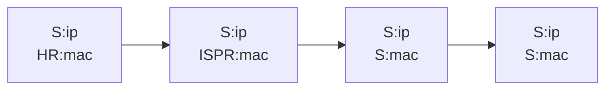
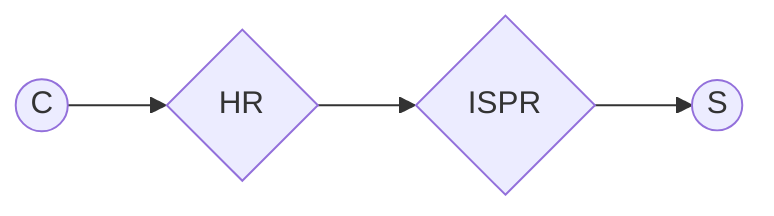
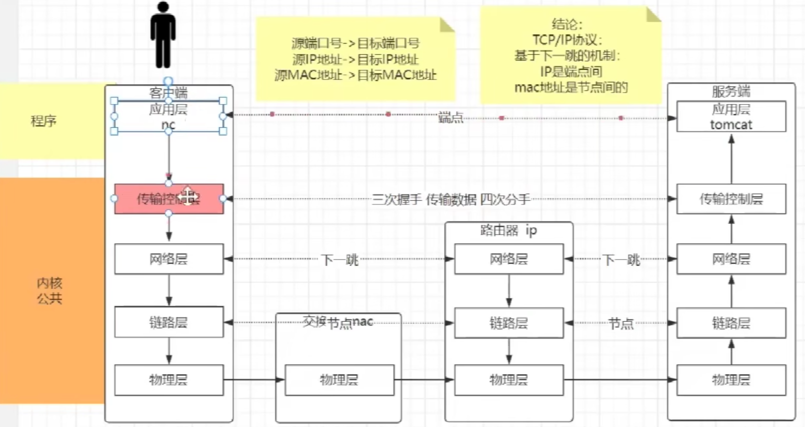

# others
#### 1. 三次握手:建立资源
---
$$
\begin{CD}
   c @>>syn> s \\
   \\ c @<<syc+ack< s \\
   \\ c @>ack>> s
\end{CD}
$$

---

#### 2. socket 插座套接字
唯一性：只有客户端的端口可变在同一个服务中
> 四元组 (源端IP + port, 服务器端IP + port)
> port: 65535个

###### 同一个服务和相同的端口可以连接服务器相同服务的不同端口

三次握手
> IP 192.168.89.131.36972 > 180.101.50.188.80: Flags [S]
  >- 第一次 c to s 发送了syn

> IP 180.101.50.188.80 > 192.168.89.131.36972: Flags [S.]
  >- 第二次 s to c 发送了syn+ack

> IP 192.168.89.131.36972 > 180.101.50.188.80: Flags [.]
  >- 第三次 c tp s 发送了ack
```shell
[root@fox01 ~]# tcpdump -nn -i ens160 port 80
dropped privs to tcpdump
tcpdump: verbose output suppressed, use -v[v]... for full protocol decode
listening on ens160, link-type EN10MB (Ethernet), snapshot length 262144 bytes
00:03:04.452138 IP 192.168.89.131.36972 > 180.101.50.188.80: Flags [S], seq 2446625167, win 64240, options [mss 1460,sackOK,TS val 3548632240 ecr 0,nop,wscale 7], length 0
00:03:04.474243 IP 180.101.50.188.80 > 192.168.89.131.36972: Flags [S.], seq 3323558428, ack 2446625168, win 64240, options [mss 1460], length 0
00:03:04.474367 IP 192.168.89.131.36972 > 180.101.50.188.80: Flags [.], ack 1, win 64240, length 0
```

---
数据传输
```shell
00:03:04.474456 IP 192.168.89.131.36972 > 180.101.50.188.80: Flags [P.], seq 1:78, ack 1, win 64240, length 77: HTTP: GET / HTTP/1.1
00:03:04.474851 IP 180.101.50.188.80 > 192.168.89.131.36972: Flags [.], ack 78, win 64240, length 0
00:03:04.496093 IP 180.101.50.188.80 > 192.168.89.131.36972: Flags [P.], seq 1:1453, ack 78, win 64240, length 1452: HTTP: HTTP/1.1 200 OK
00:03:04.496140 IP 192.168.89.131.36972 > 180.101.50.188.80: Flags [.], ack 1453, win 63888, length 0
00:03:04.497126 IP 180.101.50.188.80 > 192.168.89.131.36972: Flags [P.], seq 1453:2782, ack 78, win 64240, length 1329: HTTP
00:03:04.497141 IP 192.168.89.131.36972 > 180.101.50.188.80: Flags [.], ack 2782, win 63888, length 0
```
#### 2. 四次分手：目的-释放资源，双方步调一致释放资源。
前两部是他的可靠性，确认数据表，并未断开。
第三次服务器结束
第四次客户端反馈
```shell
# F = finish; P = push; . = acknowledge;
# 1次分手
00:03:04.497259 IP 192.168.89.131.36972 > 180.101.50.188.80: Flags [F.], seq 78, ack 2782, win 63888, length 0
# 2次分手
00:03:04.497505 IP 180.101.50.188.80 > 192.168.89.131.36972: Flags [.], ack 79, win 64239, length 0
# 3次分数
00:03:04.518754 IP 180.101.50.188.80 > 192.168.89.131.36972: Flags [FP.], seq 2782, ack 79, win 64239, length 0
# 4次分手
00:03:04.518846 IP 192.168.89.131.36972 > 180.101.50.188.80: Flags [.], ack 2783, win 63888, length 0
```
#### 程序和queue来交互拿到字节数组，并不是和tcp直接交互。

---
#### 3. 网络层
##### IP:子网-网络号。类似地址前缀
ip地址2部分组成，为了缩小范围
ip & netmask = 网络号
131 = 这个网络中的主机号
>- IPADDR=192.168.89.131
>- NETMASK=255.255.255.0
>- GATEWAY=192.168.89.2  下一跳。例如家中的路由器是下一跳（网络连接点太多无法储存，但是知道自己本地的地址）家中设备下一跳是家中的路由器；路由器是isp的某一个节点，是家中路由器的下一跳；。。。好处是设备小巧轻盈，更小的内存只要有路由规则就可
>- DNS1=192.168.1.1  域名解释服务器：把例如www.baidu.com帮你解释返回给你才可以登录网站。否则输入ip地址太繁琐无法记忆。

route
```
[root@fox01 ~]# route -n
Destination0.0.0.0表示任何地址；
Gateway表示下一跳的地址;0.0.0.0表示不需要下一跳的网关
Kernel IP routing table
Destination     Gateway         Genmask         Flags Metric Ref    Use Iface
0.0.0.0         192.168.89.2    0.0.0.0         UG    100    0        0 ens160
192.168.89.0    0.0.0.0         255.255.255.0   U     100    0        0 ens160

上面的ip是ip地址和netmask与之后的结果
192.168.89.131 & 255.255.255.0 = 192.168.89.0
```

#### 4. 链路层
##### mac地址， arp协议
- ##### mac地址一直在更细而目标ip不变。所以像链表，称作链路层。
示例图示如下：
- 数据中的更新

- 两个端需要通信时必须途径节点。


- 发送数据时，先在c产生情头不发，传输层先完成3次握手
- 完成3次握手之后，服务层拿到连接把发送的情头给传输层变成包在发送，接受确认（确认由内核完成）

#### 5. IO模型
程序是怎么运行的？
IO模型成本？为什么有BIO、NIO、OIO、EPOLL、AIO

##### IO模型原理