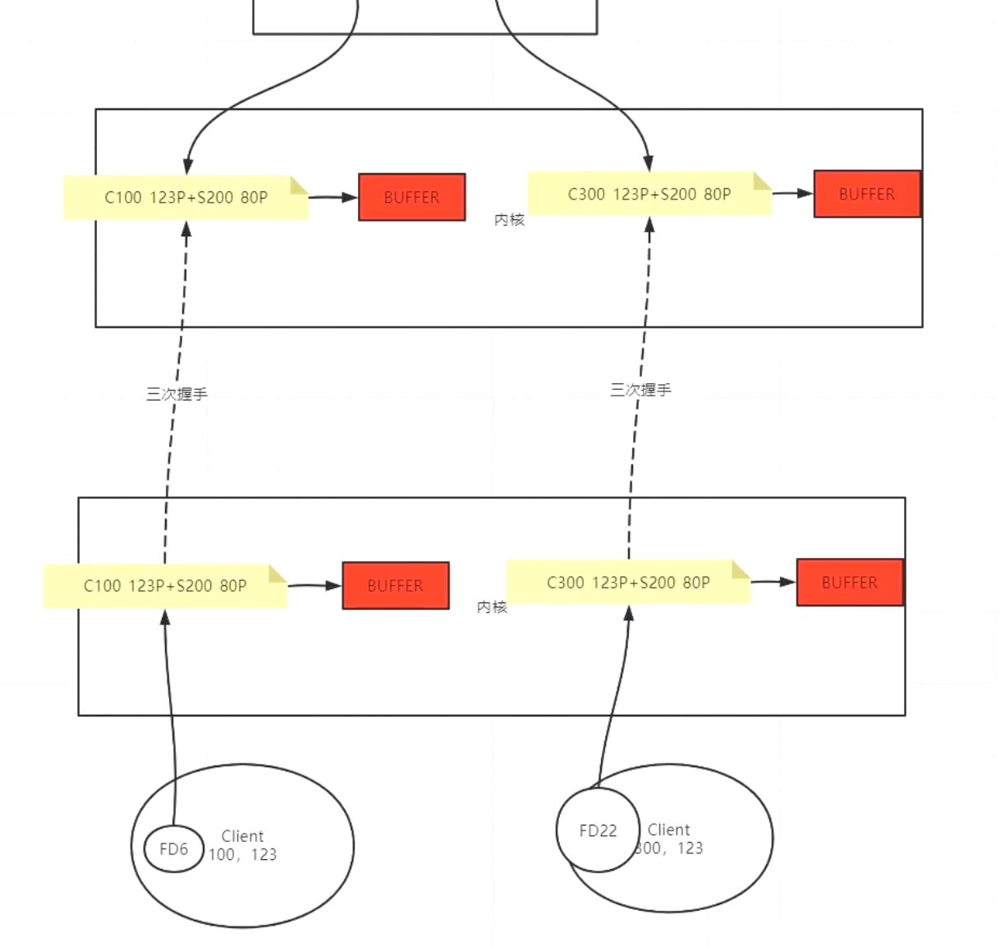
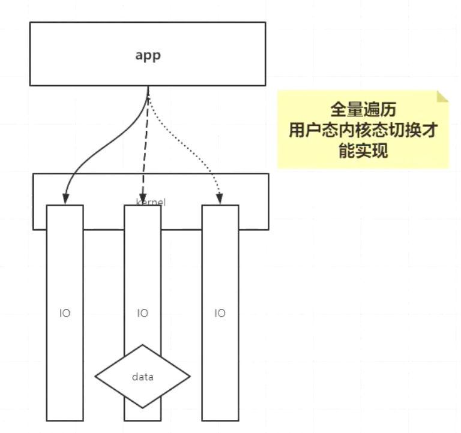
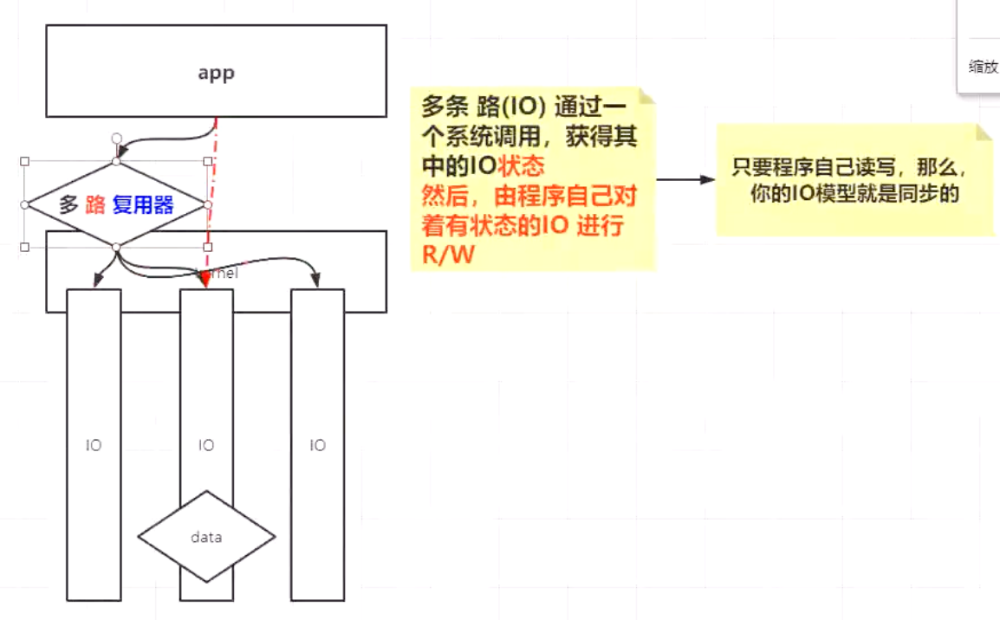

# others
#### 1. 三次握手:建立资源
---
$$
\begin{CD}
   c @>>syn> s \\
   \\ c @<<syc+ack< s \\
   \\ c @>ack>> s
\end{CD}
$$

---

#### 2. socket 插座套接字
唯一性：只有客户端的端口可变在同一个服务中
> 四元组 (源端IP + port, 服务器端IP + port)
> port: 65535个

###### 同一个服务和相同的端口可以连接服务器相同服务的不同端口

三次握手
> IP 192.168.89.131.36972 > 180.101.50.188.80: Flags [S]
  >- 第一次 c to s 发送了syn

> IP 180.101.50.188.80 > 192.168.89.131.36972: Flags [S.]
  >- 第二次 s to c 发送了syn+ack

> IP 192.168.89.131.36972 > 180.101.50.188.80: Flags [.]
  >- 第三次 c tp s 发送了ack
```shell
[root@fox01 ~]# tcpdump -nn -i ens160 port 80
dropped privs to tcpdump
tcpdump: verbose output suppressed, use -v[v]... for full protocol decode
listening on ens160, link-type EN10MB (Ethernet), snapshot length 262144 bytes
00:03:04.452138 IP 192.168.89.131.36972 > 180.101.50.188.80: Flags [S], seq 2446625167, win 64240, options [mss 1460,sackOK,TS val 3548632240 ecr 0,nop,wscale 7], length 0
00:03:04.474243 IP 180.101.50.188.80 > 192.168.89.131.36972: Flags [S.], seq 3323558428, ack 2446625168, win 64240, options [mss 1460], length 0
00:03:04.474367 IP 192.168.89.131.36972 > 180.101.50.188.80: Flags [.], ack 1, win 64240, length 0
```

---
数据传输
```shell
00:03:04.474456 IP 192.168.89.131.36972 > 180.101.50.188.80: Flags [P.], seq 1:78, ack 1, win 64240, length 77: HTTP: GET / HTTP/1.1
00:03:04.474851 IP 180.101.50.188.80 > 192.168.89.131.36972: Flags [.], ack 78, win 64240, length 0
00:03:04.496093 IP 180.101.50.188.80 > 192.168.89.131.36972: Flags [P.], seq 1:1453, ack 78, win 64240, length 1452: HTTP: HTTP/1.1 200 OK
00:03:04.496140 IP 192.168.89.131.36972 > 180.101.50.188.80: Flags [.], ack 1453, win 63888, length 0
00:03:04.497126 IP 180.101.50.188.80 > 192.168.89.131.36972: Flags [P.], seq 1453:2782, ack 78, win 64240, length 1329: HTTP
00:03:04.497141 IP 192.168.89.131.36972 > 180.101.50.188.80: Flags [.], ack 2782, win 63888, length 0
```
#### 2. 四次分手：目的-释放资源，双方步调一致释放资源。
前两部是他的可靠性，确认数据表，并未断开。
第三次服务器结束
第四次客户端反馈
```shell
# F = finish; P = push; . = acknowledge;
# 1次分手
00:03:04.497259 IP 192.168.89.131.36972 > 180.101.50.188.80: Flags [F.], seq 78, ack 2782, win 63888, length 0
# 2次分手
00:03:04.497505 IP 180.101.50.188.80 > 192.168.89.131.36972: Flags [.], ack 79, win 64239, length 0
# 3次分数
00:03:04.518754 IP 180.101.50.188.80 > 192.168.89.131.36972: Flags [FP.], seq 2782, ack 79, win 64239, length 0
# 4次分手
00:03:04.518846 IP 192.168.89.131.36972 > 180.101.50.188.80: Flags [.], ack 2783, win 63888, length 0
```
#### 程序和queue来交互拿到字节数组，并不是和tcp直接交互。

---
#### 3. 网络层
##### IP:子网-网络号。类似地址前缀
ip地址2部分组成，为了缩小范围
ip & netmask = 网络号
131 = 这个网络中的主机号
>- IPADDR=192.168.89.131
>- NETMASK=255.255.255.0
>- GATEWAY=192.168.89.2  下一跳。例如家中的路由器是下一跳（网络连接点太多无法储存，但是知道自己本地的地址）家中设备下一跳是家中的路由器；路由器是isp的某一个节点，是家中路由器的下一跳；。。。好处是设备小巧轻盈，更小的内存只要有路由规则就可
>- DNS1=192.168.1.1  域名解释服务器：把例如www.baidu.com帮你解释返回给你才可以登录网站。否则输入ip地址太繁琐无法记忆。

route
```
[root@fox01 ~]# route -n
Destination0.0.0.0表示任何地址；
Gateway表示下一跳的地址;0.0.0.0表示不需要下一跳的网关
Kernel IP routing table
Destination     Gateway         Genmask         Flags Metric Ref    Use Iface
0.0.0.0         192.168.89.2    0.0.0.0         UG    100    0        0 ens160
192.168.89.0    0.0.0.0         255.255.255.0   U     100    0        0 ens160

上面的ip是ip地址和netmask与之后的结果
192.168.89.131 & 255.255.255.0 = 192.168.89.0
```

#### 4. 链路层
##### mac地址， arp协议
- ##### mac地址一直在更细而目标ip不变。所以像链表，称作链路层。
示例图示如下：
- 数据中的更新

- 两个端需要通信时必须途径节点。


- 发送数据时，先在c产生情头不发，传输层先完成3次握手
- 完成3次握手之后，服务层拿到连接把发送的情头给传输层变成包在发送，接受确认（确认由内核完成）

#### 5. IO模型
程序是怎么运行的？
IO模型成本？为什么有BIO、NIO、OIO、EPOLL、AIO

##### IO模型原理
1. BIO 阻塞
2. NIO 非阻塞；每次循环时，大量浪费系统调用是无意义的。
3. c10k：1w个连接系统调用发生的次数降低。
4. 多路复用器
   - select poll
   - epoll

#### 6. 什么是进程什么是线程
进程。
- 程序文件进入内存之后必须按照格式展开，比如：
> 栈（主方法中的变量）---堆---常量区（省空间内存）---代码段

线程。操作系统级别。

#### 7. 线程池，内存池，连接池。出现池化技术在规避系统调用

# 操作系统宏观介绍
冯诺依曼：计算器，控制器，主存储器，输入输出设备
内存 cpu IO设备 kernel app
1. 两个程序打开同一个文件
   - 访问的虚拟文件系统
   - dirty 统一管理flush
2. 虚拟目录树
3. 文件类型
   - 软链接：快捷方式
   - 硬链接：同一个物理地址，类似cpp中的引用
4. 任何程序都有0,1,2
   - 0：标准输入
   - 1：标准输出
   - 2：报错输出
5. echo $$ 当前互动bash pid
   - /proc/$$/fd 当前所有文件描述符
   - [root@fox01 proc]# lsof -op $$查看当前进程bash所有文件描述符的细节，偏移量等
6. 重定向：不是命令，是一种机制
   - < >
7. 管道 |
8. PageCache kernel方案。例如打开同一个文件，这个文件在物理上是一个，多个程序访问的时候，会有一个seek来指向这个文件的pagecache不同的偏移量。
   - int 0x80:128-->放入寄存器：终端描述符匹配0、1、2、128 call back方法、255
   - 程序在物理内存连续，但是映射的实际函数是乱序。使用了page来映射，4kB的块。
9. page cache是内核维护的中间层
   - 使用多大内存 
   - 是否淘汰
   - 是否延迟，是否丢失数据
> page cache优化IO性能，丢失数据

   ```
   [root@fox02 ~]# sysctl -a | grep dirty
    vm.dirty_background_bytes = 0
    vm.dirty_background_ratio = 10
    vm.dirty_bytes = 0
    vm.dirty_expire_centisecs = 3000
    vm.dirty_ratio = 20
    vm.dirty_writeback_centisecs = 500
    vm.dirtytime_expire_seconds = 43200
   ```
   - buffered IO 速度快于普通的IO，因为减少了大量的系统调用。只有当8kB的缓冲区慢了之后才执行一次系统调用。

# 网络IO
## 命令
> lsof -p 
> netstat -natp
> tcpdump

## tpc
>1. 面向连接的可靠的协议
   >>- 三次握手-->内核开辟资源
   >>- 三次握手之后开辟资源，资源代表了所谓的连接。cs都会开辟资源。
>2. socket是一个四元组(CIP, CPOR, SIP, SPOR)是内核级；即使不调用accept内核也会建立连接和内容接受。服务器即使在阻塞阶段。
>3. 面试题：c为aip，cport，s为xip，xport。IP地址代表主机，通过端口号进程之间建立关系。一台服务器可以启动多个服务进行listen，但是listen端口号不可重复。
   >>- 服务端是否需要为client的链接分配一个随机端口号？
       不需要
   >>- 客户端可以多个port链接服务器端同一个port
   >>- 如果c端65535个端口已经建立去a服务器某一个端口，可不可以在从c建立端口去b服务器或者同服务器的其他端口号。也就是端口号是否会重复使用在客户端？
       可以。只要socket唯一，因为socket是四元组。

   >>- win窗口
   >>- 内核在阻塞情况下超过缓冲区大小会丢掉过多数据
>4. keepalive
   >>- 如果双方建立了连接，长时间不说话，你可以确定对方还在吗？
---
## 网络IO 变化模型
> strace -ff -o out cmd
1. 同步
2. 异步；没有异步阻塞模型

1. 阻塞
2. 非阻塞

## C10k
- BIO的弊端：阻塞blocking
- NIO
  - 优势：通过一个或几个线程，来解决N个IO链接的处理。
  - 弊端：虽然一个线程可以解决所有问题，但是会触发系统调用。引入C10K问题，单线程每循环一次，O（n）复杂度recv调用。很多调用是浪费的，1万个调用中可能只有两三个有效调用。无效无用read被调起。遍历所有，用户态和内核态切换才能实现。每条路消耗一次系统调用。

- 多路复用器。多路的路是每一个IO
  - 一次系统调用访问所有路，获得其中的IO状态。然后由程序自己对着有状态的IO进行读写R/W。只要程序自己读写，那么你的IO模型就是同步的。


---

## 网络通信IO，基于socket
BIO-->NIO-->多路复用器